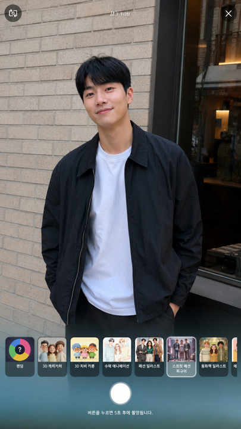
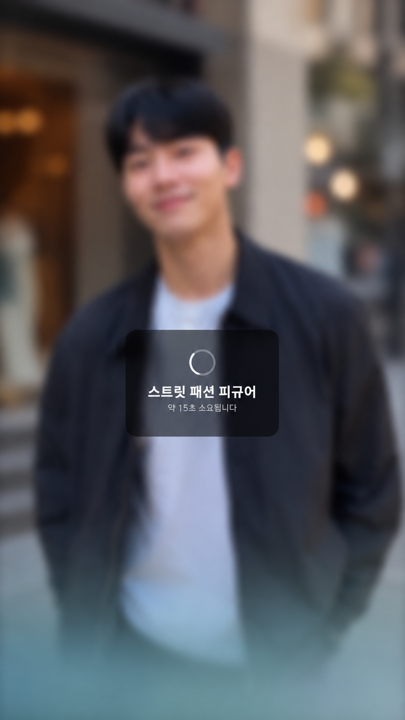
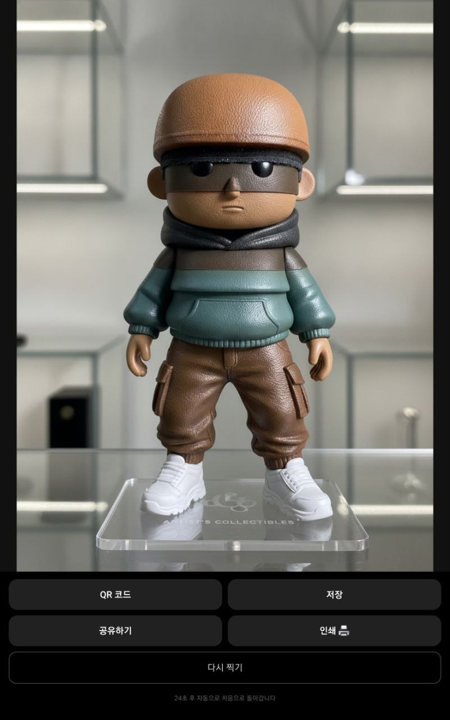
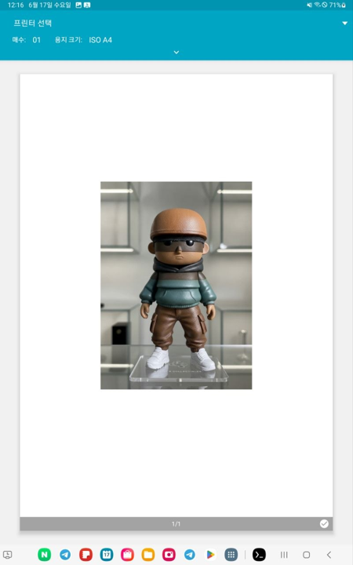

# itsyou_open

**오픈소스 로컬 AI 포토부스** — 갤럭시탭 한 대로 셀카를 찍고, AI가 15가지 스타일로 변환해 QR로 공유하거나 인쇄까지 합니다.

---

## 특징 / 차별점

- **GPU 불필요** — Gemini 또는 OpenAI API를 사용하므로, 무거운 GPU 없이 태블릿만으로 동작합니다. (기존 AI 포토부스 오픈소스는 대부분 RTX급 GPU 필수)
- **AI 변환 + 인쇄 + QR 공유를 한 프로젝트에 통합** — 이 세 가지를 모두 갖춘 오픈소스는 itsyou_open이 처음입니다.
- **태블릿 단독 키오스크** — 갤럭시탭 한 대가 서버이자 촬영 기기입니다. 별도 PC/서버 불필요.
- **프리셋 15종 큐레이션** — 저작권 클리어된 15가지 스타일(3D 캐리커처, 수채 애니메이션, CCTV 추적 등)을 즉시 사용 가능하고, 어드민 페이지에서 자유롭게 추가/수정 가능합니다.
- **API 키 로컬 저장** — 첫 화면에서 입력한 API 키는 기기 내부(`~/.itsyou/config.json`)에만 저장되며, 브라우저나 외부 서버로 전송되지 않습니다.

| 1. 촬영 | 2. AI 변환 중 | 3. 결과 | 4. 인쇄 |
|:---:|:---:|:---:|:---:|
|  |  |  |  |

> 셀카를 찍으면 AI가 선택한 스타일로 변환하고, QR 공유·인쇄까지 한 번에.

---

## 요구사항

- 갤럭시탭 (Android, Chrome 브라우저)
- [Termux](https://f-droid.org/packages/com.termux/) 앱 (안드로이드용 터미널)
- **Python 3.11 이상**
- **Gemini 또는 OpenAI API 키** (둘 중 하나만 있으면 됩니다)

> PC(Mac/Windows/Linux)에서도 개발/테스트 목적으로 실행 가능합니다.

---

## API 키 발급

API 키는 **무료 플랜**으로 시작할 수 있습니다. 둘 중 하나만 준비하면 됩니다.

| 제공자 | 발급 페이지 |
|--------|------------|
| **Gemini** (권장) | https://aistudio.google.com/apikey |
| **OpenAI** | https://platform.openai.com/api-keys |

---

## 설치 & 실행

### 갤럭시탭 (권장)

갤럭시탭에서 바로 사용하는 방법입니다. 한 번만 하면 됩니다.

**1단계: Termux 설치**

F-Droid에서 Termux를 설치합니다. (Google Play 버전은 구버전이라 권장하지 않습니다)
- F-Droid 앱 → Termux 검색 → 설치
- 또는 https://f-droid.org/packages/com.termux/ 에서 APK 직접 다운로드

**2단계: 설치 스크립트 실행**

Termux를 열고 아래 한 줄을 붙여넣기하세요:

```bash
bash <(curl -s https://raw.githubusercontent.com/parkds-claude/itsyou_open/main/install.sh)
```

> 인터넷이 느리거나 위 명령이 안 된다면, `install.sh` 내용을 직접 복사해서 Termux에 붙여넣어도 됩니다.

**3단계: 브라우저 접속**

Termux에 `http://localhost:5080` 이 표시되면, 갤탭의 Chrome에서 해당 주소를 열어 사용합니다.

---

### PC (개발/테스트용)

Mac, Windows, Linux에서 동작을 확인하거나 개발할 때 사용합니다.

```bash
# 1. 저장소 복제
git clone https://github.com/parkds-claude/itsyou_open.git
cd itsyou_open

# 2. 의존성 설치
pip install -r requirements.txt

# 3. 서버 시작
python app.py
```

브라우저에서 `http://localhost:5080` 을 엽니다.

---

## 사용법

1. **첫 화면**: Gemini 또는 OpenAI 중 사용할 AI를 선택하고, 해당 API 키를 입력합니다. (키는 기기 내부에만 저장됩니다)
2. **스타일 선택**: 15가지 프리셋 중 원하는 스타일을 고릅니다.
3. **촬영**: 카운트다운 후 셀카를 찍습니다.
4. **AI 변환**: Gemini/OpenAI가 사진을 선택한 스타일로 변환합니다. (수초~수십초 소요)
5. **결과 공유**:
   - **QR 코드**: 같은 와이파이에 연결된 폰으로 QR을 스캔하면 결과 이미지를 바로 받을 수 있습니다.
   - **저장**: 화면에서 다운로드 버튼으로 이미지를 저장합니다.
   - **인쇄**: 갤탭에 프린터를 연결해 두었다면 인쇄 버튼으로 4×6 인화를 뽑을 수 있습니다.

---

## ⚠️ 보안 주의사항

이 프로그램을 안전하게 사용하려면 아래 내용을 반드시 읽어주세요.

**네트워크 노출 범위**

- 이 서버는 같은 와이파이 네트워크에 **결과 사진 조회용으로만** 노출됩니다.
- 촬영(`/snap`), API 키 설정, 어드민 기능은 **localhost(기기 자신)에서만** 호출 가능하며, 외부에서는 자동으로 차단됩니다.
- **result URL을 아는 사람은 해당 사진을 볼 수 있습니다.** 신뢰하는 사람들만 있는 와이파이에서 사용하세요.

**절대 하지 말아야 할 것**

- **공용 와이파이**(카페, 공항, 호텔 등)에서는 사용하지 마세요.
- **포트포워딩** 또는 **ngrok/터널 서비스**로 인터넷에 노출하지 마세요. API 키 악용 및 과금 폭탄이 발생할 수 있습니다.

**API 키 보안**

- 입력한 API 키는 `~/.itsyou/config.json`(파일 권한 600, 본인만 읽기 가능)에 저장되며, 브라우저 또는 외부 서버로 전송되지 않습니다.

**운영 주의**

- `FLASK_DEBUG=true` 상태로 운영하지 마세요. 내부 정보가 노출될 수 있습니다.

---

## 호환성

| 기기 | 촬영 | 비고 |
|------|------|------|
| 갤럭시탭 (Android Chrome) | ✅ | **권장 기기.** Termux에서 서버를 구동합니다 |
| 아이패드 / 아이폰 | ❌ | iOS에서는 Python 서버를 직접 실행할 수 없어 현재 미지원입니다 (향후 HTTPS 모드로 확장 검토 중) |
| Mac / Windows / Linux | ✅ | PC에서 서버 실행 후 `localhost:5080` 접속 시 촬영 가능 (개발/테스트용) |
| 다른 폰 (QR로 사진 받기) | ✅ | 같은 와이파이라면 결과 사진 조회만 가능합니다 |

**기타 호환성 안내**

- 아이폰 Safari는 전체화면 버튼이 동작하지 않습니다.
- 인터넷 연결이 없는 환경에서는 제목 폰트가 기본 폰트로 표시됩니다 (기능에는 영향 없음).
- 인쇄 시 용지 크기(4×6)는 브라우저 인쇄 다이얼로그에서 **"사진용지 4×6"** 또는 **"사용자 지정"**으로 직접 선택하세요.

---

## 프리셋 커스터마이즈

**어드민 페이지에서 추가/수정**

서버를 시작하면 콘솔(Termux 화면)에 어드민 키가 표시됩니다:

```
[itsyou] Admin Key: a1b2c3d4e5f6...
[itsyou] Admin page: http://localhost:5080/admin
```

갤탭 Chrome에서 `http://localhost:5080/admin` 을 열고, 이 키를 입력하면 프리셋을 추가하거나 수정할 수 있습니다.

**직접 파일 편집**

`data/itsyou_presets.json` 파일을 직접 수정할 수도 있습니다. 서버를 재시작하면 반영됩니다.

**프리셋 기여 시 주의사항**

- 브랜드명(디즈니, 지브리, 픽사 등) 또는 특정 작가 실명을 프롬프트에 포함하지 마세요.
- 타인의 프롬프트를 그대로 복사하지 마세요. 화풍·아이디어는 자유롭게 참고할 수 있습니다.

---

## 라이선스

[MIT License](./LICENSE) — 자유롭게 사용, 수정, 배포할 수 있습니다.

---

## 기여

PR 환영합니다! 특히 **프리셋 추가**를 환영합니다.

- 버그 리포트: [Issues](https://github.com/parkds-claude/itsyou_open/issues)
- 새 프리셋 제안: PR로 `data/itsyou_presets.json`에 추가
- 새 AI 제공자 추가: `providers/<name>.py` 파일 하나만 추가하면 됩니다 (`providers/base.py` 인터페이스 참고)

> 프리셋 PR 시 위 "프리셋 기여 시 주의사항"을 반드시 확인해 주세요.
